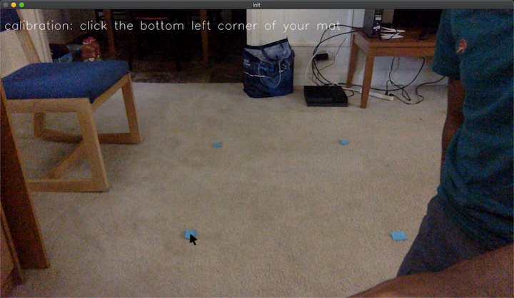
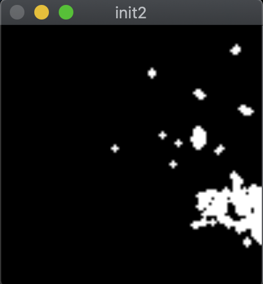
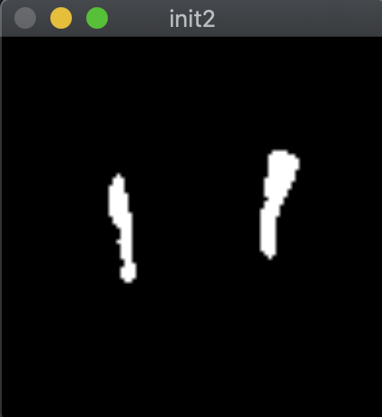

# CV DDR Controller

This was a fun weekend project where I tried to build a DDR
(dance dance revolution) controller using just a webcam and some Python.


## Setup Instructions

First, download the project and start the script using the following command.

```bash
git clone https://github.com/tchittesh/ddr_cv.git
    && cd ddr_cv
    && python ddrController.py
```

You'll want to set up an environment where your feet have good contrast with
a darker background (I used white socks). Then, click on the corners of
what will be your virtual DDR mat. This will set up the homography mapping
points on the image to points on the virtual DDR mat.



Then, you'll be asked to calibrate for the amount of brightness in the
environment. Use the arrow keys to adjust the "exposure" until just the
outline of your feet are visible. Press enter when done.

Before | After
:-------------------------:|:-------------------------:
 | 

And your controller should appear, along with some visualization to show you
what it thinks you're doing! The script will also simulate keypresses
according to what square on the 3x3 grid you're stepping on. This is how I
connect to StepMania (an open source DDR simulator). Change line 29
of `ddrController.py` to customize what keys this maps to.

## Performance

After testing the controller with StepMania, I found that feet
positions are pretty consistently tracked. The program also consistently runs
at 30 fps, which is fairly good although nowhere near enough for a rhythm game.

The main problem is a tendency for false positive button presses while playing.
This is due to the heuristic I used, which assumed that if a foot is moving, it
is in the air, and if a foot is stationary, it's grounded.
Unfortunately, when making repeated steps, there's a moment when your foot
reverses directions and is technically motionless, producing these false
positives.

My best score was around 40% on a Level 3 (Easy) song
(for comparison, 60% is pretty good), so it works!! ... a little
